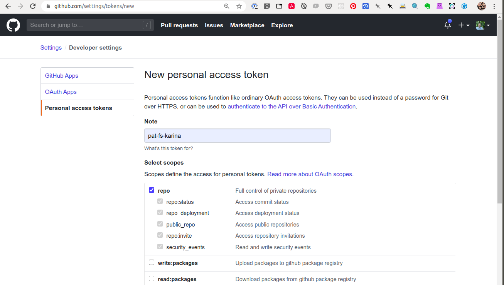

# Build Cluster

This directory contains the basic scripts and deployments to spin up a 
small build cluster and deploy self-hoster github runners.

## Quickstart

Create a Personal Access Token (PAT) on Github [Here](https://github.com/settings/tokens)

(To navigate in the GUI: **Account Settings** -> **Developer Settings** -> **Personal access tokens**)

**Generate new token** with `repo` scopes:



Copy the generate PAT and set the environment variables `GH_PAT` to it's value

```bash
export GH_PAT=_THE_COPIED_PAT_VALUE_
```

Then run the `build-build-cluster.sh` script.
