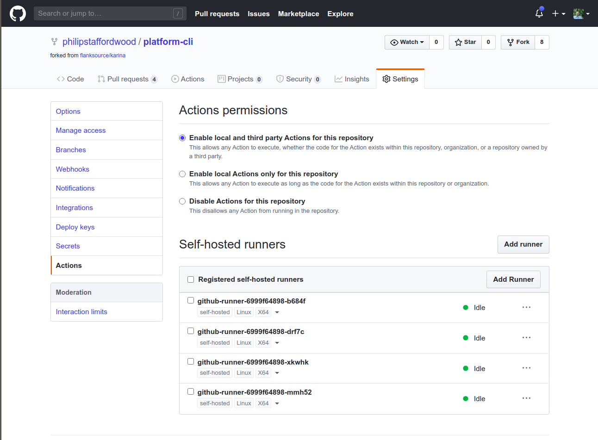

# Build Cluster

This directory contains the basic scripts and deployments to spin up a 
small build cluster and deploy self-hoster github runners.

## Deploy

Create a Personal Access Token (PAT) on Github [Here](https://github.com/settings/tokens)

(To navigate in the GUI: **Account Settings** -> **Developer Settings** -> **Personal access tokens**)

**Generate new token** with `repo` scopes:


Copy the generate PAT and set the environment variables `GH_PAT` to it's value

```bash
export GH_PAT=_THE_COPIED_PAT_VALUE_
```

Then run the `build-build-cluster.sh` script.

## Verify deployment

List runner pods using `kubectl get pods -lapp=github-runner`, e.g.:

```bash
philip@silent:/code/flanksource/vsphere-lab-issue-7-build-cluster/build-cluster$ kubectl get pods -lapp=github-runner
NAME                             READY   STATUS    RESTARTS   AGE
github-runner-6999f64898-b684f   1/1     Running   0          89s
github-runner-6999f64898-drf7c   1/1     Running   0          89s
github-runner-6999f64898-mmh52   1/1     Running   0          89s
github-runner-6999f64898-xkwhk   1/1     Running   0          89s
```

Check logs with `logs -lapp=github-runner`

```bash
philip@silent:/code/flanksource/vsphere-lab-issue-7-build-cluster/build-cluster$ kubectl logs -lapp=github-runner

# Runner settings


√ Settings Saved.


√ Connected to GitHub

2020-06-01 14:52:06Z: Listening for Jobs

# Runner settings


√ Settings Saved.


√ Connected to GitHub

2020-06-01 14:52:18Z: Listening for Jobs

# Runner settings


√ Settings Saved.


√ Connected to GitHub

2020-06-01 14:52:20Z: Listening for Jobs

# Runner settings


√ Settings Saved.


√ Connected to GitHub

2020-06-01 14:52:28Z: Listening for Jobs

```

Check Status on Github:


